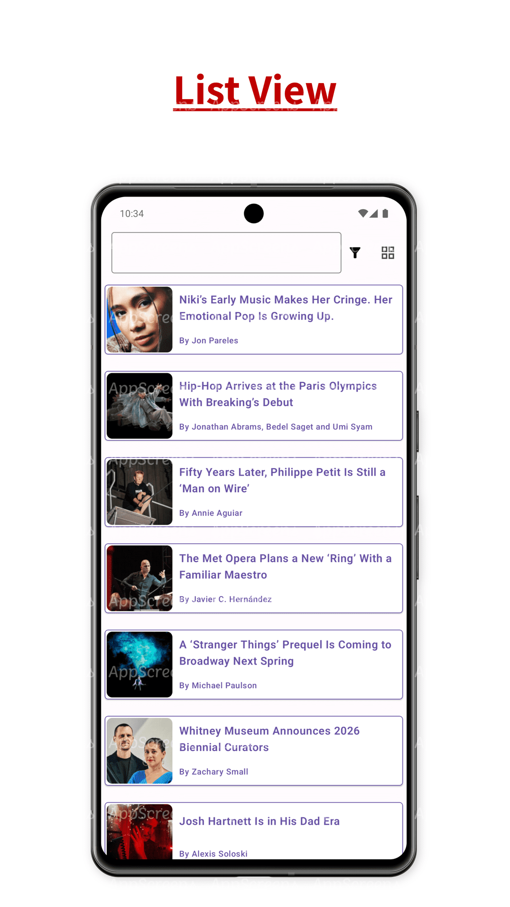
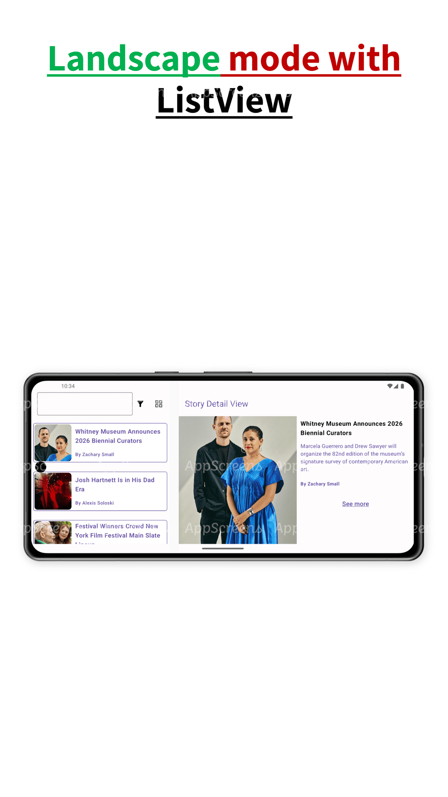

# NYTimes Sample App

## Overview
The NYTimes app is a sample Android application built using Jetpack Compose and Clean Architecture principles. It leverages the New York Times Top Stories API to display a list/grid of the latest stories on the home screen. When a story is selected, the app navigates to a detailed view of the story.

## Features
- Display top stories from the New York Times on the home screen in a list/grid format.
- Navigate to a detailed view of a selected story.
- Built using Jetpack Compose for modern, declarative UI development.
- Adheres to Clean Architecture principles for maintainable and testable code.

Screenshots
-----------



## Tech Stack
- **Kotlin**: Programming language used for Android development.
- **Jetpack Compose**: Modern toolkit for building native UI.
- **Clean Architecture**: Organizes code into layers to separate concerns.
- **Retrofit**: HTTP client for making API requests.
- **Hilt**: Dependency Injection library.
- **Coroutines**: For asynchronous programming.
- **Flow**: For handling data streams.
- **ViewModel**: Lifecycle-aware components for managing UI-related data.
- **Coil**: Image loading library for Android.

## Prerequisites
- Android Studio Arctic Fox or later.
- A valid New York Times API key. Sign up [here](https://developer.nytimes.com/signup) to get your API key.

## Getting Started
1. **Clone the repository**:
   ```bash
   git clone https://github.com/mik237/NYTimes-Compose.git

2. **Open the project in Android Studio**:
    - Open Android Studio.
    - Select `Open an existing project`.
    - Navigate to the cloned repository and open it.
   
3. **Set up API Key**:
   - Create a `local.properties` file in the root directory of the project.
   - Add your New York Times API key in the `local.properties` file:
   - API_KEY=your_api_key_here

4. **Build and Run the app**:

## Libraries Used
- [Jetpack Compose](https://developer.android.com/jetpack/compose): Modern UI toolkit.
- [Retrofit](https://square.github.io/retrofit/): Type-safe HTTP client.
- [Hilt](https://dagger.dev/hilt/): Dependency Injection.
- [Coroutines](https://kotlinlang.org/docs/coroutines-overview.html): Asynchronous programming.
- [Flow](https://developer.android.com/kotlin/flow): Handling data streams.
- [Coil](https://coil-kt.github.io/coil/): Image loading.
